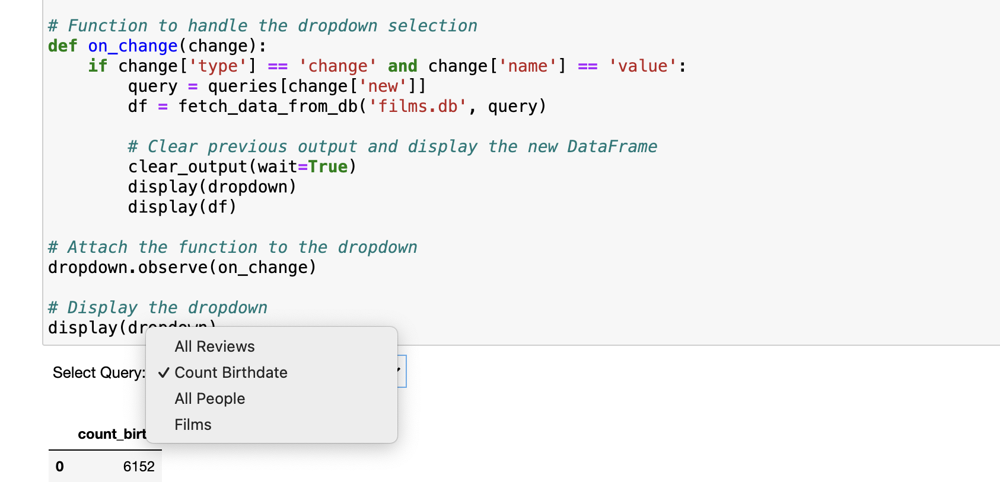
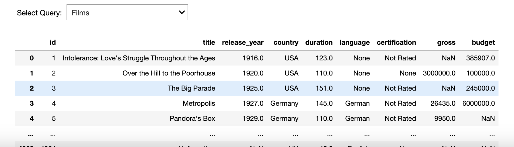
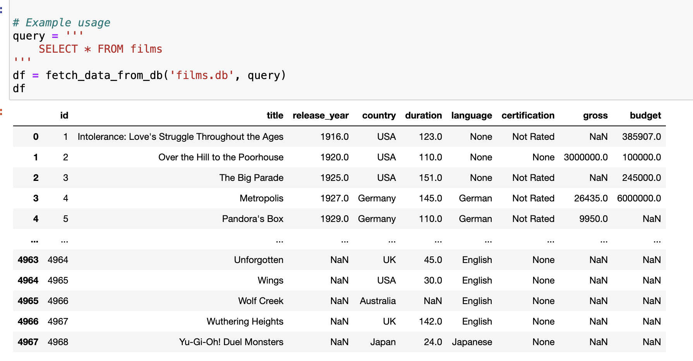

**Learning SQL with Jupyter Notebooks and Dropdowns**

Welcome to the **Learning SQL** repository! This project is designed to enhance your SQL learning experience by utilizing Jupyter Notebooks combined with dropdown menus for an interactive and intuitive exploration of SQL queries.

**About**

This repository is based on my learning journey through DataCamp’s **Intermediate SQL** course. The goal is to provide an engaging environment where you can practice SQL using sample tables, experiment with queries, and visualize the results seamlessly.

**Key Features**

​	•	**Interactive Dropdown Menus:** Select SQL queries from a predefined list using a dropdown menu, making it easy to explore different datasets without writing complex code.

​	•	**Sample Tables:** Utilize a variety of sample tables to practice SQL queries, including films, people, and reviews.

​	•	**Pandas Integration:** Use Pandas to execute SQL queries and transform the results into DataFrames for easy analysis and visualization.

​	•	**CSV Loading:** Includes a Jupyter Notebook to demonstrate how to load CSV files into a SQLite database for hands-on practice.

**How It Works**

**1. Dropdown Menus for SQL Queries**

The dropdown menu allows you to select from different SQL queries stored in a dictionary. This feature is perfect for quickly running various queries and viewing the results.

**2. Query Execution and Visualization**

Execute SQL queries using Pandas to retrieve data from the SQLite database. The queries are written within template literals, making it easy to modify and experiment.

